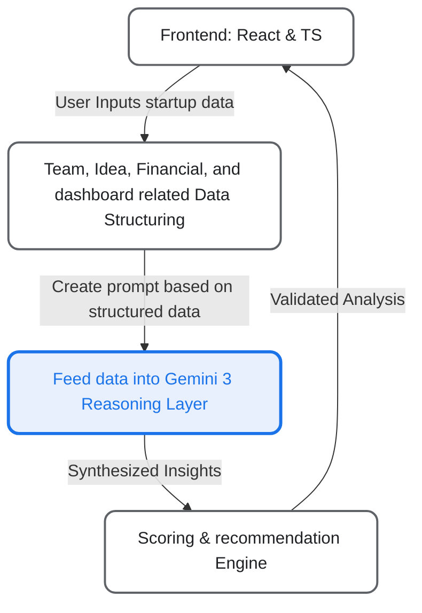

## 🚀 Getting Started

Follow these instructions to set up and run the Foundry platform locally on Windows.

### Prerequisites (Windows)
Ensure you have the following installed before proceeding:

1.  **Python** (3.10+)
2.  **Node.js** (v18+)
3.  **Rust** (Required for compiling certain Python dependencies)
    -   Download and install from [rustup.rs](https://rustup.rs/)
4.  **Visual Studio Build Tools** (Required for C++ extensions in Python packages)
    -   Download [Visual Studio Build Tools](https://visualstudio.microsoft.com/visual-cpp-build-tools/)
    -   During installation, select **"Desktop development with C++"**.

### 1. Environment Setup

Create a `.env` file in the **root** directory (`/Foundry/.env`) and add your API keys:

```ini
GEMINI_API_KEY=your_google_gemini_api_key
```

### 2. Backend Setup
The backend is built with FastAPI and handles all data processing and AI logic.

Open a new terminal (PowerShell or Command Prompt):

```powershell
# Navigate to the backend directory
cd Backend

# Create a virtual environment
python -m venv venv

# Activate the virtual environment
.\venv\Scripts\activate

# Install dependencies
pip install -r requirements.txt

# Run the database migrations (if applicable) & Start the server
# The server will start on http://localhost:8000
uvicorn main:app --reload
```

### 3. Frontend Setup
The frontend is a React application built with Vite.

Open a **separate** terminal window:

```powershell
# Navigate to the frontend directory
cd Auto

# Install Node.js dependencies
npm install

# Start the development server
# The app will run on http://localhost:5173
npm run dev
```

### 4. Running
Once both servers are running:
-   **Frontend**: Open [http://localhost:5173


### Foundry System Architecture

This document also maps the high-level architecture of **Foundry**, designed to be scalable, modular, and AI-native. This architecture supports real-time feedback loops between the user's input and the platform's AI intelligence engine.


### Simple High-Level Flow
**"Gemini reasons. Foundry decides."**



## System Overview Diagram

```mermaid
graph TB
    subgraph Client ["Client Layer (User Experience)"]
        UI[Foundry Web App]
        DescUI[React 19 + Vite + TypeScript]
    end

    subgraph API ["API Layer (Gateway)"]
        Server[Foundry Backend API]
        DescServer[FastAPI + Pydantic]
        
        Auth[Auth Router]
        Users[User Router]
        Org[Workspace Router]
        Fin[Financials Router]
        Dash[Dashboard Router]
        
        Server --> Auth
        Server --> Users
        Server --> Org
        Server --> Fin
        Server --> Dash
    end

    subgraph Data ["Data Layer (Persistence)"]
        DB[(Foundry Database)]
        DescDB[SQLite / SQLAlchemy ORM]
    end

    subgraph Async ["Intelligence Layer (Async Workers)"]
        WorkerManager[Background Worker Manager]
        DescWorker[Python Threading + Queue]
        
        JobQueue[Job Queue]
        
        Worker1[Idea Analysis Worker]
        Worker2[Founder Alignment Worker]
        Worker3[Investor Readiness Worker]
        Worker4[Dashboard Insight Worker]
        
        WorkerManager --> JobQueue
        JobQueue --> Worker1
        JobQueue --> Worker2
        JobQueue --> Worker3
        JobQueue --> Worker4
    end

    subgraph External ["External Services"]
        Gemini[Google Gemini 1.5 Pro]
        DescAI[LLM Inference]
    end

    %% Key Data Flows
    UI -- "REST API (JSON)" --> Server
    Server -- "Read/Write" --> DB
    Server -- "Dispatch Job" --> DB
    
    WorkerManager -- "Polls Jobs" --> DB
    
    Worker1 -- "Prompt Engineering" --> Gemini
    Worker2 -- "Prompt Engineering" --> Gemini
    Worker3 -- "Prompt Engineering" --> Gemini
    Worker4 -- "Prompt Engineering" --> Gemini
    
    Gemini -- "Structured Analysis" --> WorkerManager
    WorkerManager -- "Save Insights & Results" --> DB

    %% Styling
    classDef client fill:#e1f5fe,stroke:#01579b,stroke-width:2px;
    classDef api fill:#e8f5e9,stroke:#2e7d32,stroke-width:2px;
    classDef data fill:#fff3e0,stroke:#ef6c00,stroke-width:2px;
    classDef worker fill:#f3e5f5,stroke:#7b1fa2,stroke-width:2px;
    classDef external fill:#eceff1,stroke:#455a64,stroke-width:2px,stroke-dasharray: 5 5;

    class UI,DescUI client;
    class Server,DescServer,Auth,Users,Org,Fin,Dash api;
    class DB,DescDB data;
    class WorkerManager,DescWorker,JobQueue,Worker1,Worker2,Worker3,Worker4 worker;
    class Gemini,DescAI external;
```



## Architectural Highlights (For Hackathon Judges)

### 1. **Asynchronous Intelligence Engine**
The system uses a **decoupled worker pattern** to handle heavy AI workloads. Instead of making the user wait for Gemini to generate complex analyses (which can take 10-30 seconds), the API dispatches a background job.
-   **Benefit**: The UI remains instant and responsive.
-   **Mechanism**: Pending jobs are stored in the database and picked up by specialized worker threads.

### 2. **Modular Router Design**
The backend is split into domain-specific routers (`financials`, `workspaces`, `analysis`).
-   **Benefit**: Clean separation of concerns. This allows different parts of the platform (e.g., Financial Modeling vs. Founder Psychology) to evolve independently without breaking each other.

### 3. **Structured AI Integration**
We don't just "chat" with the AI. We use **Structured Prompt Engineering** to force the LLM to return strictly formatted JSON data.
-   **Benefit**: The AI's output is directly actionable programmatically. We can render charts, graphs, and scores from the AI's response, rather than just displaying a text block.

### 4. **Scalable Data Model**
The database schema (`Organization`, `OrgMember`, `Financials`, `ReadinessGate`) is designed to capture the **entire lifecycle** of a startup, from idea to Series A.
-   **Benefit**: The platform creates a "Digital Twin" of the startup, allowing for deep simulations and "What If" analysis.

## Core Data Flows

### A. Idea Validation Flow
1.  **User Input**: User enters startup problem, solution, and target market in the UI.
2.  **API Call**: Frontend sends data to `/analysis/validate`.
3.  **Job Creation**: Backend creates an `idea_analysis` job in the `jobs` table (Status: `PENDING`).
4.  **Worker Pickup**: `idea_analysis_worker` detects the new job.
5.  **AI Processing**: Worker constructs a complex prompt and sends it to **Gemini 1.5 Pro**.
6.  **Result Storage**: Gemini returns JSON (TAM size, personas, roadmap). Worker saves this to `ai_idea_analysis` table.
7.  **Polling/Push**: Frontend polls (or uses WebSocket) to detect job completion and renders the results.

### B. Founder Alignment Flow
1.  **Data Aggregation**: System aggregates psychographic data from multiple founders (Risk tolerance, equity expectations, time commitment).
2.  **Analysis**: `founder_alignment_worker` feeds this multi-party dataset to the AI.
3.  **Risk Detection**: AI identifies specific conflicts (e.g., "CEO expects 80h/week, CTO only committing 20h/week").
4.  **Actionable Advice**: System generates a unified "Alignment Score" and specific mediation steps.

---](http://localhost:5173) in your browser.
-   **Backend API Docs**: Open [http://localhost:8000/docs](http://localhost:8000/docs) to explore the API via Swagger UI.
